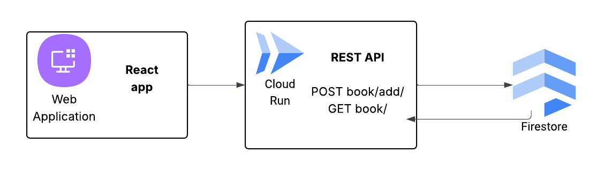

# Michelle's Submission for Tome's Take Home Challenge

This repository contains code for a REST API that allows anyone to add books to a database and search for them by title or author with a single query string, as well as an ugly React app for demo purposes.

## Trying it out

### Demo

From the `frontend/` directory: run `npm install` to install dependencies then `npm run dev` to run the React app at http://localhost:5173/.

### Server

The server is deployed at https://tome-backend-477723450381.us-east1.run.app and allows unauthenticated requests. There is also [auto-generated API Documentation](https://tome-backend-477723450381.us-east1.run.app/docs/).

To run the server locally:

1. Have Michelle add you to the GCP project

2. Run `gcloud auth application-default login` (install [`gcloud`](https://cloud.google.com/sdk/docs/install) if you haven't already)

3. From the `backend/` directory: run `npm install` to install dependencies

4. From the `backend/` directory: run `npm start`. You should see a log message like so and viola the server is running on `localhost`!
   > ```
   > {"level":30,"time":1744931218956,"pid":20884,"hostname":"Mao","msg":"Server listening at
   > http://127.0.0.1:3000"}
   > ```

## Notes

### Main tools

- **Google Cloud Run**: For hosting the server in a containerized, serverless fashion

  - No alternatives considered because I'm most familiar with the 0->1 setup of a REST API in Cloud Run and I knew it would be option I could build quickest with and that the free tier was more than sufficient for this project.

- **Firestore**: NoSQL Database

  - Alternative considered: MangoDB. Mainly because that's what Tome uses and I've never used it so it would be a good opportunity to learn. Also potentially for easy integration with Elasticsearch which I considered briefly (more on that below). However I ultimately decided to prioritize development speed here. Since only one data model is required I went with the option that would be the simpliest to integrate--GCP's NoSQL DB solution (Firestore).

- **[Fastify](https://www.fastify.io)**: Web framework for server

  - Alternative considered: A GraphQL API (Apollo Client). I learned the amazing ways of GraphQL from swsh, but it would definitely be overkill for this project. What was tempting was the amazing client-side caching benefits offered by Apollo Client, since this is a read-heavy app. But still overkill.

- **[Fuzzysort](https://github.com/farzher/fuzzysort)**: Library to perform search on book items

  - Alternative considered: No server-side searching. Instead, DB query includes a `startsWith` filter with the search string on the author and/or title. But this makes the searching experience less enjoyable for users and we care about users here.
  - Alternative considered: Elasticsearch. First thing that came to mind when I saw the search requirement. But I also have no experience with Elasticsearch and after some quick research decided the learning curve was not worth it here.

- **[React Router](https://github.com/remix-run/react-router-templates/tree/main/default)**: Specifically the default template for the frontend
  - No alternatives considered.

### Architecture Diagram



### Considerations and Assumptions

1. Support English only

2. All books added to the database should be candidates for search

3. Users want to search by title and/or author

4. Users are searching for a specific book rather than browsing. As a result, we optimize for speed by limiting to a maximum of 10 results returned (by default).

5. Perhaps the **biggest assumption made:** Allowing for fuzzy search (i.e. results do not have to match search string exactly) is more important than database read costs ($ and latency). So this implementation fetches _all_ books in the database and then performs fuzzy search.

## Next steps

<ins>Performance optimizations</ins>

1.  **Cache search result** - We expect this app to be read-heavy, so it's a great candidate for caching.
2.  **Thumbnail images** - Instead of taking an image url and trying to load it no matter what size it is, have the client upload the image so we can store it in the backend and optimize it for our specific needs (e.g. small thumbnail size for main page).

<ins>Product-related</ins>

1. **Better security** - Authentication of client; use signed image urls; scan for explicit/illegal content

2. **The UD of CRUD** - Support editing and deleting books

3. **Book deduplication** - Determine what is considered a duplicate book then handle it in the add book endpoint (perhaps throw error or update existing)

4. **Ranking** - Implement a ranking system for results either at the db-level or api-level

- Tune fuzzysort weights / confidence threshold
- Manual "priority" field in db
- Track and prioritize most clicked
- Use tags

5. **Advanced search** - Perhaps by format, publish date range, and/or separate author and title search. This also allows us to optimize the db query by adding filters and any corresponding indices.
